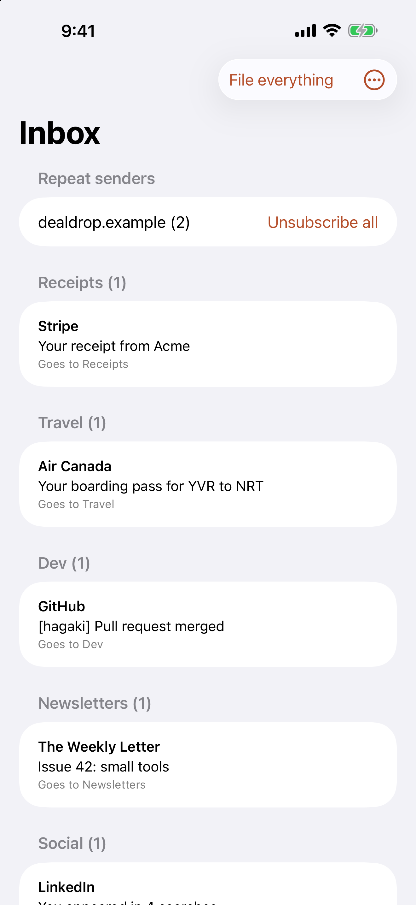
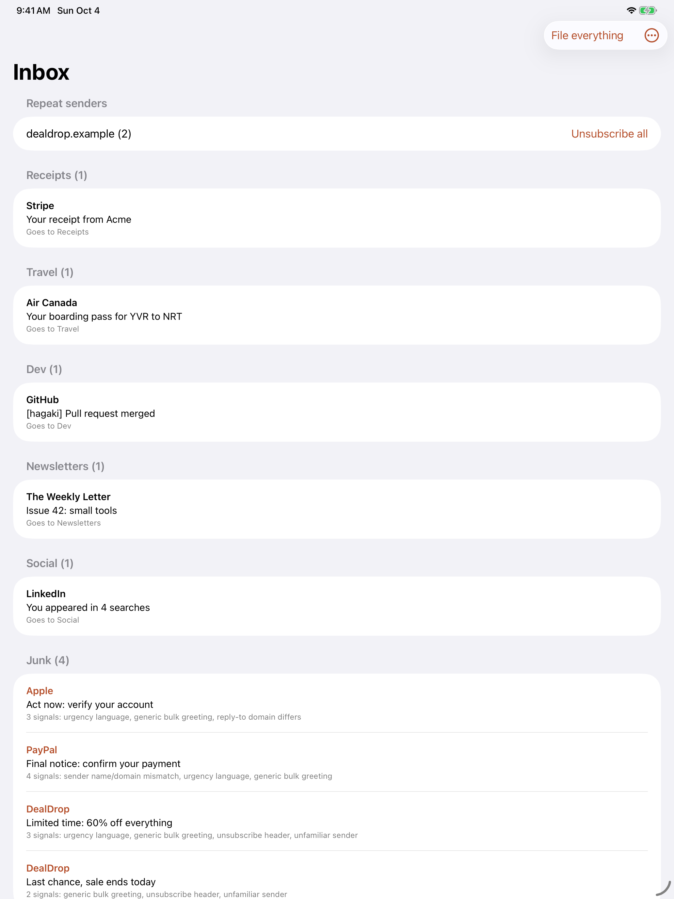
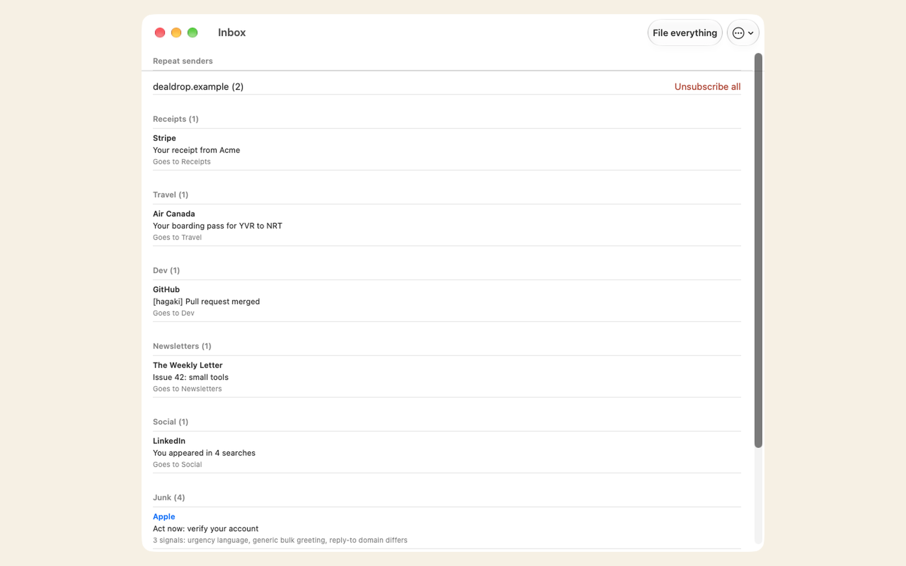
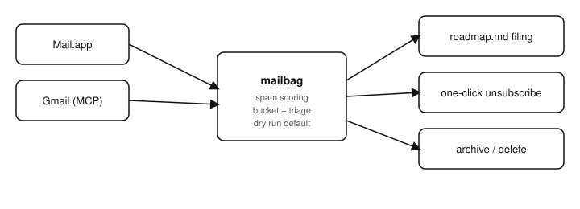

# Mailbag

  [](https://github.com/nulljosh/mailbag)

An inbox fills up whether you look at it or not. Dev-tool alerts that actually need a fix. Newsletters you never asked twice for. Notification spam wearing a real sender's name. Sorting it by hand is the same ten minutes every day, spent the same way.

That's the gap.


## What it does

Connect Gmail or iCloud and Mailbag reads your inbox. Press Clear inbox. Machine mail goes into seven folders: Receipts, Travel, Dev, Newsletters, Social, Promotions and Junk. Mail from people goes to your archive. The inbox is empty.

In Gmail the folders are labels under a label called Mailbag. In iCloud they are real folders. File everything is the gentler button. It files the machine mail and leaves people where they are.

It sorts twice. Plain rules go first: they know a receipt, a build alert and a boarding pass. A small model on Cloudflare then reads the sender and subject of machine mail the rules could not place.

Mail with no sign of a machine is treated as a person. No unsubscribe link, no no-reply address, no bulk label. It is never filed and never shown to the model. Debt and legal notices are never filed either. The sorter can still be wrong about machine mail. That is why nothing is deleted.

Nothing is deleted. Junk is only for mail that looks like a scam, and it gets a folder too. Delete is its own button, and in Gmail it goes to Trash. Unsubscribe sends the sender's own one-click request. The list is a preview, and nothing moves until you press a button.

The Claude Code side (`/mail`) still exists for the dev-tool-alert half of the job — matching an App Store Connect or GitHub Actions email to the right project and fixing or filing it — since that needs a coding agent, not a mail client. The two share the same spam-scoring rules.

## Why this and not a filter rule

A filter rule is static — it catches what you already know to catch. This reads the actual message, decides what kind of thing it is, and takes the next real step: unsubscribe and move on, or (via `/mail`) file a bug or fix a build. The difference between a spam folder and someone who actually reads your mail.

## The name

A mailbag is the sack a mail carrier empties, one address at a time, until nothing is left.

Mailbag does that to your inbox.

## Run it

Open [mailbag.heyitsmejosh.com](https://mailbag.heyitsmejosh.com) (or the iOS/macOS app), connect Gmail, triage. For the dev-tool-alert side, from a Claude Code session:

```
/mail                 dry run — read, classify, report, touch nothing
/mail apply            real pass — file, fix, archive/delete, unsubscribe
```

Full triage logic, spam scoring, and unsubscribe handling: [SKILL.md](SKILL.md).

## Screenshots

  

## Architecture


